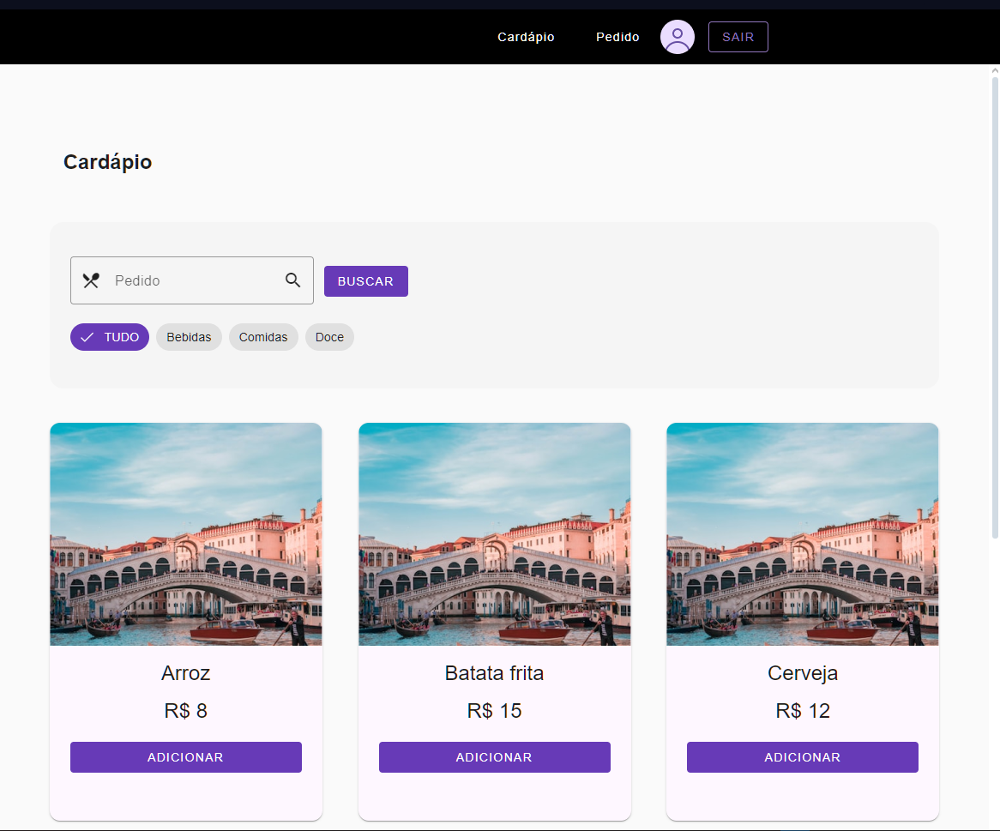
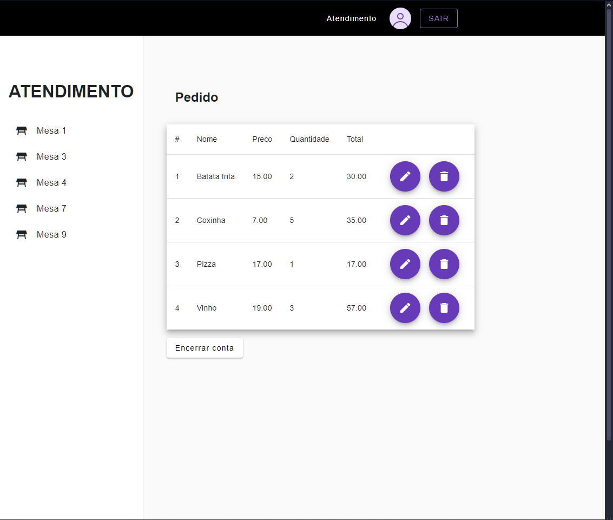

# Yes Sir

YesSir é um sistema de atendimento ao cliente em restaurantes. No momento é um MVP que está em seu início, mas que promete muitas funcionalidades novas interessantes para serem desenvolvidas.

## 🔨 Funcionalidades do projeto

Nesse primeiro momento, nós temos as jornadas iniciais para os Garçons e para as Mesas onde os clientes se encontram.

Nessa fase inicial, para os clientes das Mesas, serão disponibilizadas funcionalidades que as permitam:
1. Visualizar itens de cardápio;
2. Iniciar um pedido;
3. Adicionar a quantidade desejada dos itens de cardápio ao pedido;
4. Visualizar todos os itens que já foram pedidos até o momento;

Já para os Garçons, poderão:
1. Visualizar todas as Mesas que fizeram pedidos no momento;
2. Visualizar os pedidos para uma Mesa específica;
3. Remover itens de pedido de uma Mesa;
4. Editar a quantidade de dos itens do pedido da Mesa.

O sistema também terá:
1. Autenticação;
2. Controle de acesso às telas por perfis de usuário. Garçons não conseguem ver as telas das Mesas, e vice-versa;

O desafio é configurar o banco de dados onde serão armazenadas as informações, desenvolver a estrutura backend integrada ao banco de dados que será responsável em receber as requisições solicitadas pela interface de usuário e retornar os recursos desejados. Por fim, desenvolver uma interface de usuário web que fará as iterações com os Garçons ou as Mesas.

## 👥 Alguns usuários já cadastrados para se logar

* garcom1@bvlabs.lol / 1234
* garcom3@bvlabs.lol / 1234
* mesa1@bvlabs.lol / 1234
* mesa5@bvlabs.lol / 1234
* mesa9@bvlabs.lol / 1234

## ✔️ Tecnologias utilizadas

Lista de tudo que foi usado nesse desenvolvimento:

- `SQL com Postgres`
- `JAVA`
- `Maven`
- `API RESTful`
- `Spring Boot 3`
- `Bean Validation`
- `Spring Security`
- `Json Web Token`
- `Spring Data JPA`
- `Flyway API Migrations tool`
- `OpenAPI`
- `Javascript`
- `Rxjs`
- `Typescript`
- `Angular`
- `Angular CLI`
- `Angular Material`
- `Docker`
- `AWS ECS`
- `AWS ECR`

## 🛠️ Abrir e rodar o projeto

Para abrir e rodar o projeto, tenha o Docker instalado em sua máquina e execute `docker-compose up` para iniciar o projeto.

Depois, acesse <a href="http://localhost:4200/">http://localhost:4200/</a> no seu navegador.

O backend utilizado você encontra [aqui](https://github.com/brunovitalino/yessir-api).

O frontend utilizado você encontra [aqui](https://github.com/brunovitalino/yessir-interface).

## 📚 Mais informações do projeto

O YesSir é um projeto fictício.
A ideia principal desse projeto. é utilizar os conhecimentos adquiridos no curso de computação para demonstrar as várias possibilidades criação de novas tecnologias, seja através de desenvolvimento back-end, front-end, cloud, etc. :)
